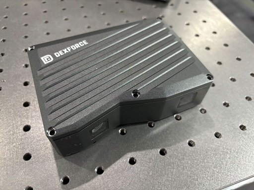
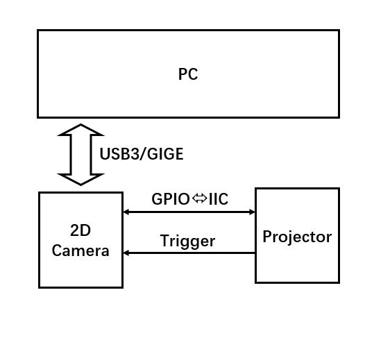
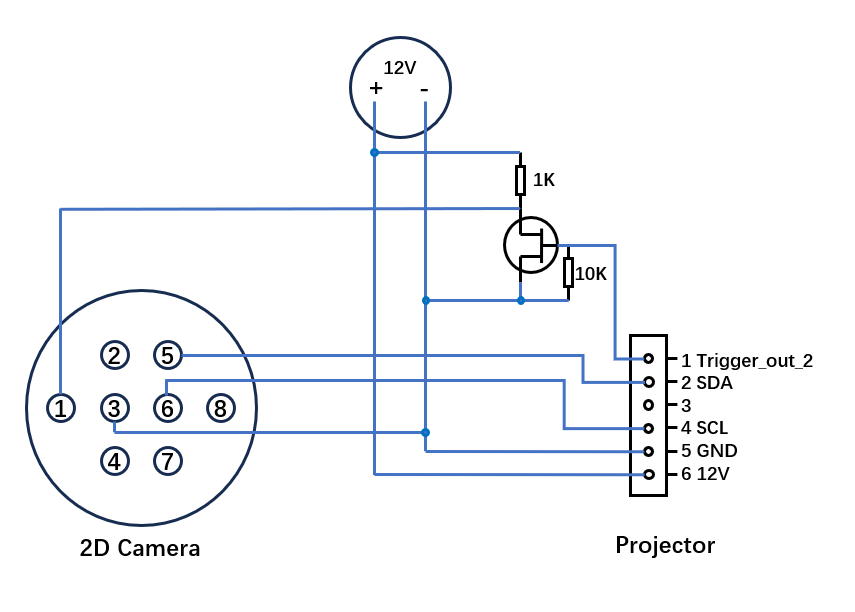
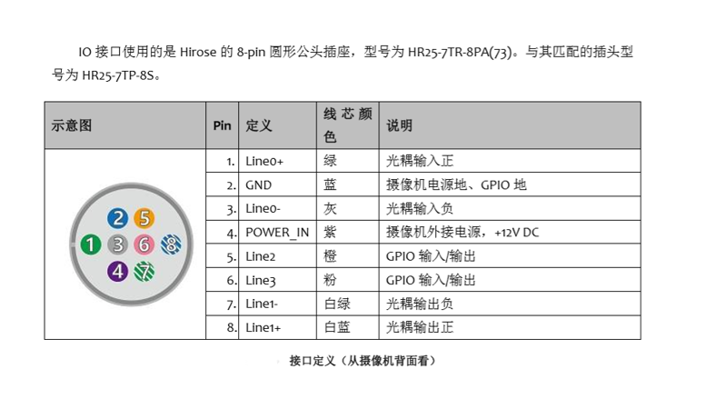

# Sparrow - Open Source DLP 3D Camera
depend:
```
pip3 install iai-gxipy
```
run:
```
python .\capture.py
```
output:
```
point_cloud.xyz
```



## Hardware Diagram
Block Diagram


Electrical Diagram


2D Camera Interface
